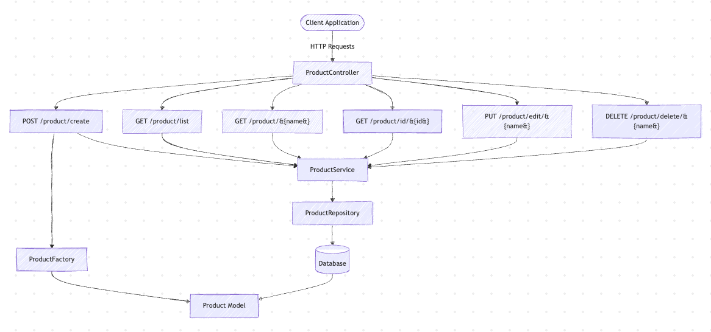
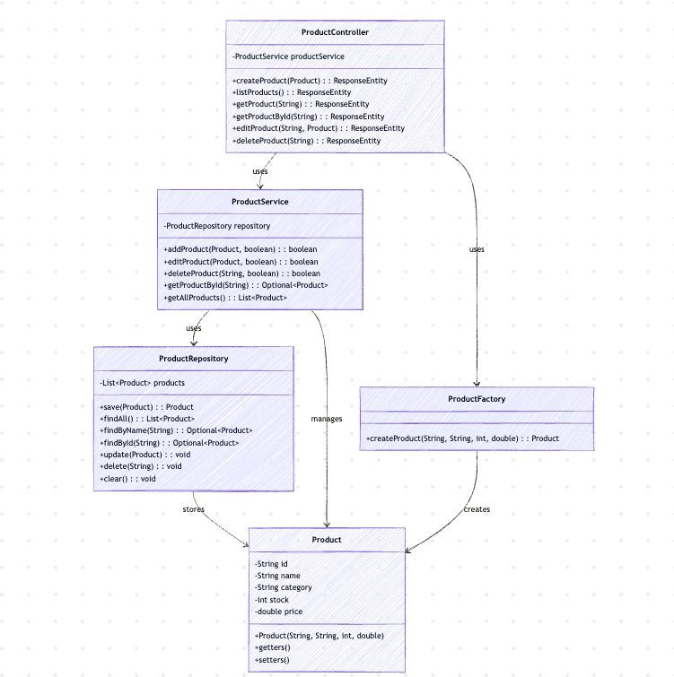
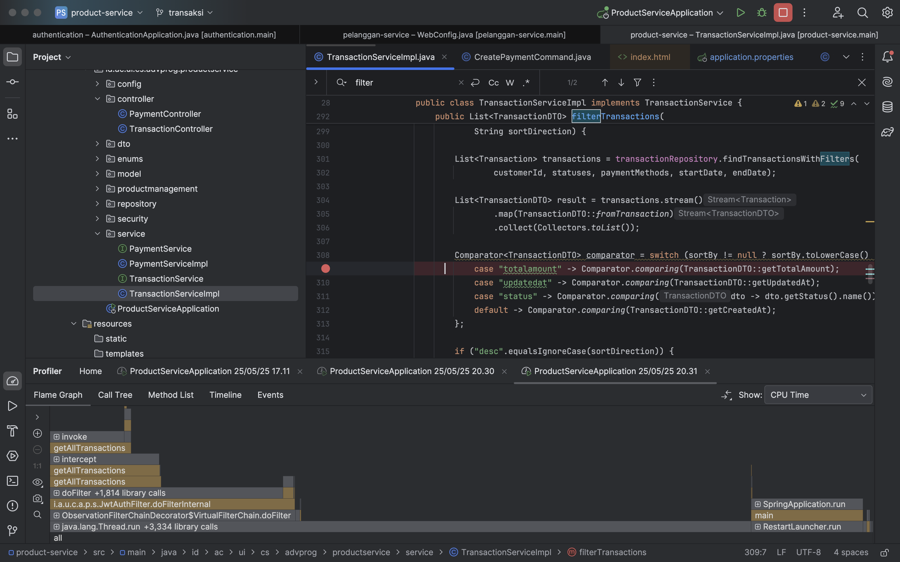
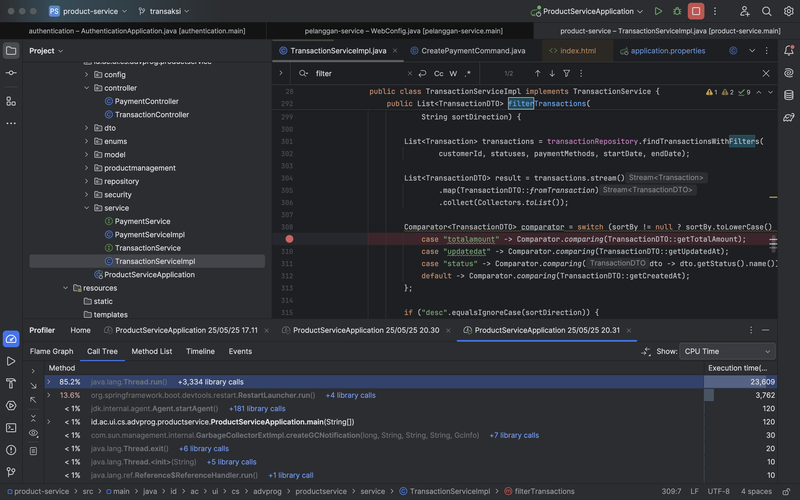
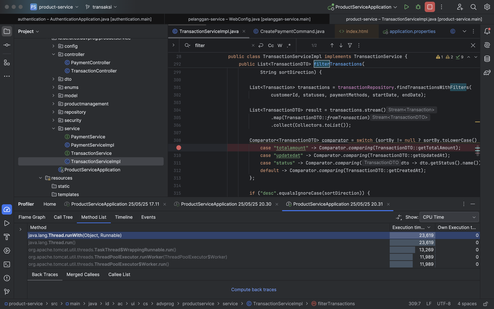

# AdvProg - B01

## Module 9
## Transaksi
> Siti Shofi Nadhifa - 2306152172
### Component Diagram

### Code Diagram

> Raja Rafael Pangihutan Sitorus - 2306244923
### Component Diagram

### Code Diagram

## Profiling
> Siti Shofi Nadhifa - 2306152172

Profiling menunjukkan bahwa method `filterTransactions()` di `TransactionServiceImpl` menjadi bottleneck utama karena menghabiskan waktu eksekusi hingga 23 detik, dengan sebagian besar waktu terpakai di pemanggilan `transactionRepository.findTransactionsWithFilters(...)` dan proses konversi ke `TransactionDTO`. Hal ini kemungkinan disebabkan oleh query database yang tidak efisien, tidak menggunakan indeks yang tepat, atau memuat terlalu banyak data ke dalam memori, ditambah dengan sorting yang dilakukan di sisi Java. Untuk meningkatkan performa, disarankan agar sorting dilakukan langsung di level query, penggunaan pagination diterapkan, dan pemetaan DTO dioptimalkan agar lebih ringan.
